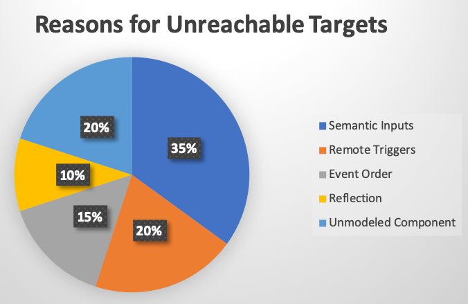

# Accuracy Evaluation

The accuracy evaluation set is used as the ground truth to analyze all reachable targets in these apps. 
This set is a subset of the benchmark apps, consisting 36 open-source apps from the benchmark which are also available on Google Play.
The selection of this subset ensures that we arrive at a representative and practically valuable subset.

This page presents:
- [list of apps](#list-of-apps): the list of apps that we used to evaluate the accuracy of GoalExplorer.
- [reasons for unreachable targets](#reasons-for-unreachable-targets): the main reasons preventing GoalExplorer from reaching these targets.

---

## List of apps

| Package Name                            | Version       | Size(KB)    |
|-----------------------------------------|---------------|-------------|
| org.jessies.dalvikexplorer              | 3.9           | 0.248046875 |
| jpf.android.diary                       | 1             | 0.022460938 |
| de.homac.Mirrored                       |  0.2.3        | 0.049804688 |
| com.kvance.Nectroid                     |  1.2.4        | 0.278320313 |
| org.wordpress.android                   |  2.0 Alpha    | 1.444335938 |
| a2dp.Vol                                |  2.11.12      | 0.5234375   |
| aarddict.android                        |  1.6.11       | 1.827148438 |
| com.addi                                | 1.98          | 20.59277344 |
| com.angrydoughnuts.android.alarmclock   | 1.9           | 0.322265625 |
| eu.domob.angulo                         | 2131099649    | 0.1875      |
| org.liberty.android.fantastischmemo     | 2131230964    | 0.9453125   |
| ch.blinkenlights.battery                | 2130968576    | 1.296875    |
| net.sf.andbatdog.batterydog             |  0.1.1        | 0.168945313 |
| jp.sblo.pandora.aGrep                   |  0.2.1        | 0.274414063 |
| com.templaro.opsiz.aka                  | 1             | 0.23046875  |
| com.evancharlton.mileage                |  3.1.1        | 0.529296875 |
| org.passwordmaker.android               |  1.1.7        | 0.124023438 |
| de.zieren.rot13                         |  1.0.2        | 0.171875    |
| marto.rtl_tcp_andro                     | 2.2           | 0.408203125 |
| net.mandaria.tippytipper                |  1.1.3        | 0.135742188 |
| de.freewarepoint.whohasmystuff          |  1.0.7        | 0.075195313 |
| org.wikipedia                           |  1.2.1        | 1.356445313 |
| com.irahul.worldclock                   | 0.6           | 1.100585938 |
| org.scoutant.blokish                    |  0.5.1        | 0.44140625  |
| com.github.cetoolbox                    | 1             | 0.193359375 |
| org.balau.fakedawn                      | 1.3           | 0.223632813 |
| org.jfedor.frozenbubble                 | 1.12          | 0.63671875  |
| com.twsitedapps.homemanager             | 2131099649    | 0.274414063 |
| com.fsck.k9                             | 3.512         | 2.630859375 |
| com.sunyata.kindmind                    |  1.0.0_BETA   | 0.422851563 |
| in.shick.lockpatterngenerator           | 2.2           | 0.278320313 |
| jp.gr.java_conf.hatalab.mnv             | 0.4           | 0.317382813 |
| org.totschnig.myexpenses                |  1.6.0        | 0.430664063 |
| org.swiftp                              | 1.25          | 0.0859375   |
| org.tomdroid                            |  0.7.5        | 1.0546875   |
| biz.gyrus.yaab                          |  1.10.1       | 0.37109375  |

---

## Reasons for Unreachable Targets

