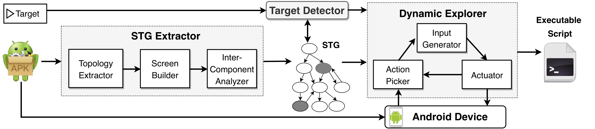

# Overview

The high-level overview of GoalExplorer is presented in the figure above. It obtains two inputs: the APK file of the app and the target functionality of interest, which can be provided as an app activity, an API call, or a code statement.

In the first step, GoalExplorer statically constructs the Screen Transition Graph (STG) of the app in the STG Extractor component. It then maps the target(s) to (possibly multiple) nodes of the graph in the Target Detector. Finally, it uses the graph to guide the dynamic exploration to a reachable target node, starting with the one that has the shortest path from the initial screen in the Dynamic Explorer.

## API Methods

STG Extractor searches for specific API invocations when constructing the nodes and transitions.

- For complete lists of API methods collected from [Android Developers](https://developer.android.com/), see:

&nbsp;&nbsp;&nbsp;&nbsp;&nbsp;&nbsp;[API Methods](apis/apimethods.md){: .btn .btn-primary .fs-5 .mb-4 .mb-md-0 .mr-2 } 